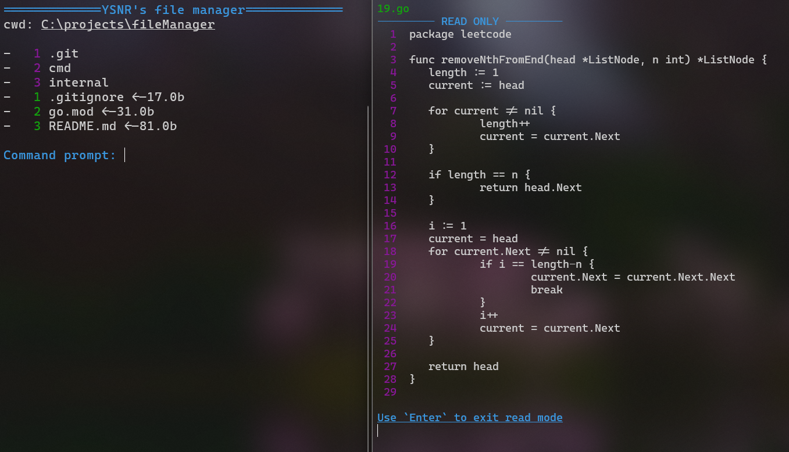

# TUI File Manager


Self-written TUI file manager inspired by Vim text editor. Command prompt like Vim command mode, you can combine commands.

## Instalation

1. Install Golang
2. Clone repository
3. Configure file manager. Move to `filemanager/internal/commamd-parser/ command-parser.go` and set your values into following settings:

- `MAX_FILE_SIZE_TO_READ` - maximum file size in bytes that can be opened
- `PATH_TO_VSCODE` - path to your executable text editor, vs code for example

4. Build

```bash
cd cmd
go build -o filemanager.exe .\main.go
```

## Usage

- to get a list of commands use

```bash
filemanager help
```

### List of commands:

- `exit` - Quit file manager
- `od<index>` - Open Directory
- `of<index>` - Open File
- `back` - move back by directory, as cd ..
- `code` - launch Visual Studio Code in current workind directory
- `mkdir` - create directory in cwd
- `mkfile` - create file in cwd
